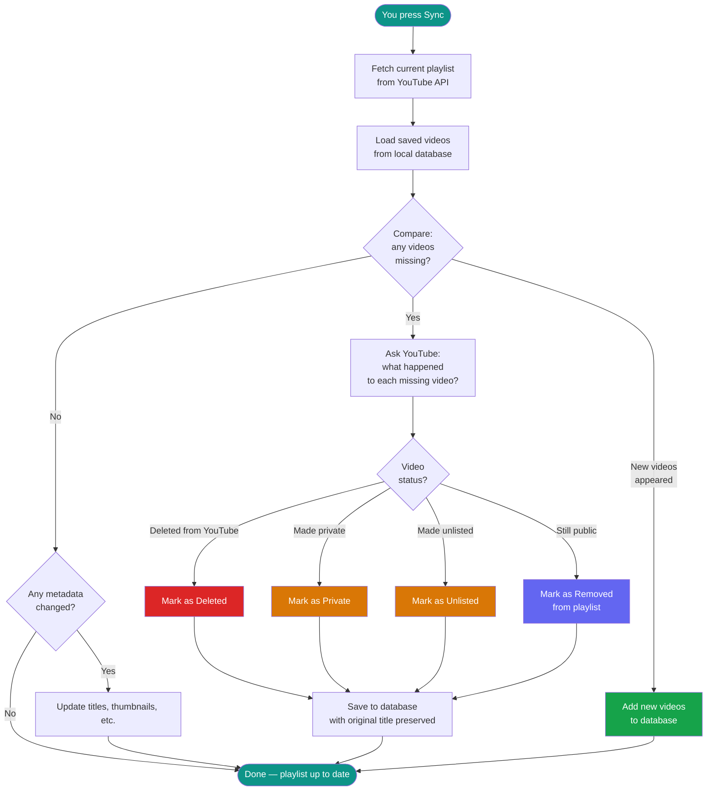

# ytpt — YouTube Playlist Tracker

Track your YouTube playlists and know exactly which videos disappeared. When a video gets deleted, made private, or removed — **ytpt** preserves the title and metadata so you always know what's gone.

## The Problem

YouTube doesn't notify you when videos are removed from your playlists. One day a playlist has 200 videos, the next it has 197 — and you have no idea which 3 vanished or why.

## Quick Start

**1. Install**

```bash
# Linux / macOS
curl -fsSL https://raw.githubusercontent.com/7KiLL/YTPlaylistTracker/main/scripts/install.sh | bash

# Windows (PowerShell)
irm https://raw.githubusercontent.com/7KiLL/YTPlaylistTracker/main/scripts/install.ps1 | iex
```

**2. Sign in**

```bash
ytpt login    # Opens browser → Sign in with Google → done
```

**3. Launch**

```bash
ytpt          # Opens the TUI — add playlists, sync, browse
```

That's it. Add a playlist URL, hit sync, and ytpt will start tracking.

## How Sync Works



**The key insight:** when a video vanishes from your playlist, ytpt makes a second API call to check the video directly. That's how it knows whether it was deleted, made private, or just removed from the playlist by the owner.

All original titles and metadata are preserved forever in your local database — even after YouTube deletes them.

## TUI Preview

```
┌─ Profiles ─┬─ Playlists ────┬─ Videos ("Music 2026") ───────────────┐
│ > Personal │ [x] Music 2026 │ #  │ Title         │ Channel │ Status │
│   Work     │ [x] Tech Talks │ 1  │ Song A        │ ArtistX │ Active │
│            │ [ ] Cooking    │ 2  │ Song B        │ ArtistY │ Active │
│            │                │ 3  │ Old Song      │ ArtistZ │ X Gone │
├────────────┴────────────────┴────┴───────────────┴─────────┴────────┤
│ h/l:pane  j/k:nav  Enter:detail  /:search  o:sort  ?:help  q:quit  │
└─────────────────────────────────────────────────────────────────────┘
```

## Install

### Linux / macOS

```bash
curl -fsSL https://raw.githubusercontent.com/7KiLL/YTPlaylistTracker/main/scripts/install.sh | bash
```

### Windows (PowerShell)

```powershell
irm https://raw.githubusercontent.com/7KiLL/YTPlaylistTracker/main/scripts/install.ps1 | iex
```

### Install a specific version

```bash
YTPT_VERSION=v0.3.0 curl -fsSL https://raw.githubusercontent.com/7KiLL/YTPlaylistTracker/main/scripts/install.sh | bash
```

### Supported platforms

| Platform | Architecture |
|----------|-------------|
| Linux | x64, arm64 |
| macOS | x64 (Intel), arm64 (Apple Silicon) |
| Windows | x64 |

## Authentication

### OAuth2 (recommended — access private playlists)

```bash
ytpt login    # Opens browser → Sign in with Google → done
ytpt logout   # Remove stored tokens
```

### API Key (public playlists only)

```bash
export YOUTUBE_API_KEY=your_key_here
ytpt
```

Get an API key from [Google Cloud Console](https://console.cloud.google.com/) → APIs & Services → Credentials → Create API Key → Enable YouTube Data API v3.

## CLI Commands

| Command | Description |
|---------|-------------|
| `ytpt` or `ytpt ui` | Launch interactive TUI |
| `ytpt login` | Sign in with Google (OAuth2) |
| `ytpt logout` | Sign out, remove stored tokens |
| `ytpt sync` | Sync all tracked playlists (headless) |
| `ytpt sync <playlist-id>` | Sync a specific playlist |
| `ytpt status` | Show tracking summary |
| `ytpt reset [--yes]` | Delete database and start fresh |
| `ytpt --help` | Show all available commands |

Add `--verbose` or `-v` to any command for debug logging.

## TUI Keybindings

| Key | Action |
|-----|--------|
| `a` / `F1` | Add playlist (paste URL or ID) |
| `t` / `F2` | Toggle tracking on/off for selected playlist |
| `T` | Toggle all playlists in profile (track all or untrack all) |
| `s` / `F5` | Sync selected playlist |
| `S` / `F6` | Sync all tracked playlists |
| `/` | Search videos by title or channel (case-insensitive) |
| `o` | Sort videos (by Title, Channel, Added Date, or Status) |
| `?` | Show help dialog |
| `Enter` | View details of selected profile/playlist/video |
| `h` / `l` | Navigate between panes (profiles, playlists, videos) |
| `j` / `k` | Navigate up/down in focused pane |
| Tab / Shift+Tab | Cycle focus between panes |
| `F8` | Toggle: show removed videos only |
| `F9` | Settings |
| `q` / `F10` | Quit |
| Ctrl+C x2 | Quick quit (double-press within 1s) |
| Esc | Close search (when searching) |

## Data Storage

All data is stored locally:

| OS | Path |
|----|------|
| Linux | `~/.local/share/ytpt/` |
| macOS | `~/Library/Application Support/ytpt/` |
| Windows | `%LOCALAPPDATA%\ytpt\` |

Contents:
- `tracker.db` — SQLite database (playlists, videos, removal history)
- `logs/` — Rolling log files (7 day retention)
- `oauth-tokens/` — Google OAuth refresh tokens

File permissions are set to owner-only (700/600) on Linux/macOS.

---

## Development

### Run from source

Requires [.NET 10 SDK](https://dotnet.microsoft.com/download):

```bash
git clone https://github.com/7KiLL/YTPlaylistTracker.git
cd YTPlaylistTracker
dotnet build
dotnet run --project src/YTPlaylistTracker.UI
```

### Install as .NET global tool

```bash
dotnet pack src/YTPlaylistTracker.UI -c Release
dotnet tool install -g --add-source src/YTPlaylistTracker.UI/nupkg ytpt
ytpt
```

### Tests

```bash
dotnet build                        # Build all
dotnet test                         # Run all tests
dotnet test --filter "SyncService"  # Run specific tests
```

### Building with OAuth credentials

```bash
dotnet publish src/YTPlaylistTracker.UI -c Release \
  -p:OAuthClientId=$YTPT_CLIENT_ID \
  -p:OAuthClientSecret=$YTPT_CLIENT_SECRET
```

OAuth credentials are injected at build time — never stored in source code.

### Architecture

Clean Architecture with four layers:

```
Domain (entities, interfaces) <- Application (sync logic) <- Infrastructure (DB, API) <- UI (TUI, CLI)
```

See [docs/architecture.md](docs/architecture.md) for details.

### Tech Stack

- **.NET 10** / C#
- **Terminal.Gui** — cross-platform TUI framework
- **System.CommandLine** — CLI argument parsing (Microsoft)
- **EF Core + SQLite** — local database
- **Google.Apis.YouTube.v3** — YouTube Data API client
- **Serilog** — structured logging
- **xUnit + NSubstitute** — testing

## License

MIT
